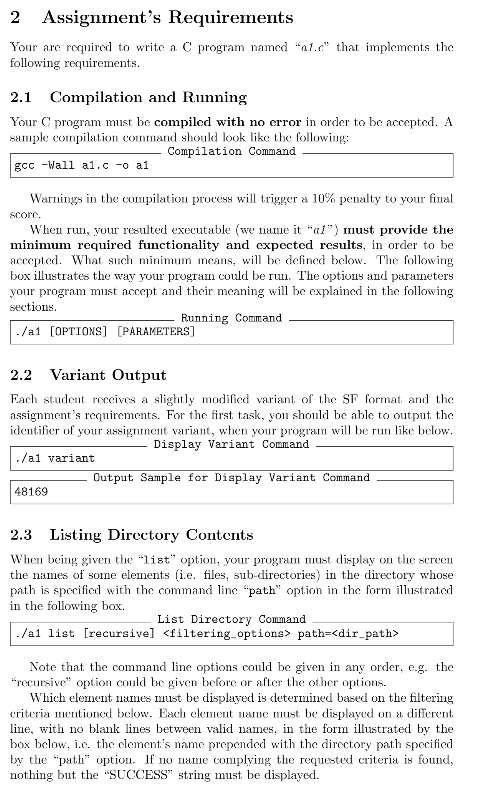

## Descriere
În acest proiect am rezolvat în C câteva task-uri primite la Sisteme de Operare (afișarea unui identificator unic al variantei de asistență și listarea conținutului unui director conform unor criterii)  
  
  


## Compilare și Rulare
Pentru a compila programul, folosește:
```sh
gcc -Wall a1.c -o a1
```
Programul trebuie executat astfel:
```sh
./a1 [OPTIONS] [PARAMETERS]
```

## Funcționalități

- **Afișare Variantă**  
  Executând comanda:
  ```sh
  ./a1 variant
  ```
  Programul va afișa un identificator unic.

- **Listare Conținut Director**  
  Programul poate lista fișierele și subdirectoarele unui director specificat.  
  Exemplu de comandă:
  ```sh
  ./a1 list [recursive] <filtering_options> path=<dir_path>
  ```
  - `recursive` – listează conținutul recursiv.
  - `filtering_options` – aplică filtre de afișare.
  - `path=<dir_path>` – specifică directorul țintă.

Dacă nu există elemente care corespund filtrării, programul afișează `SUCCESS`.
